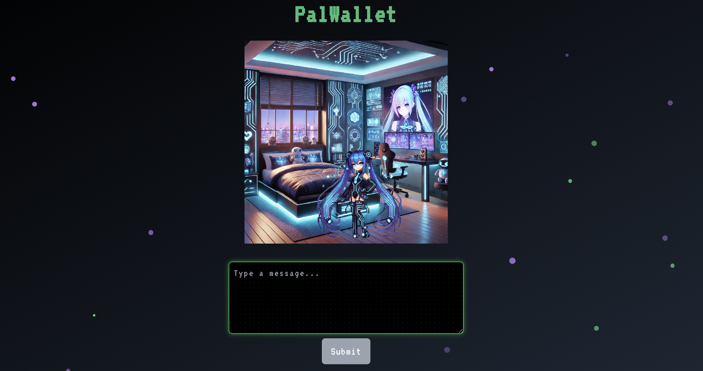
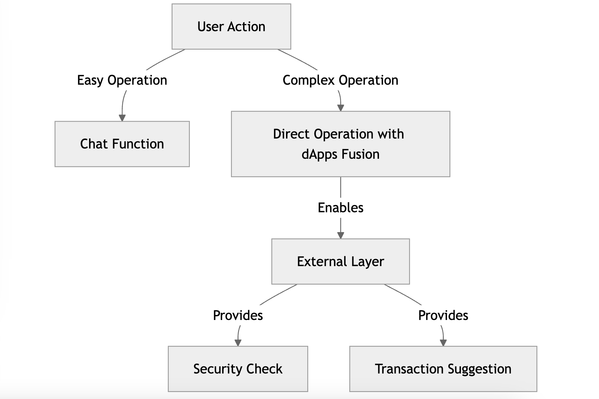
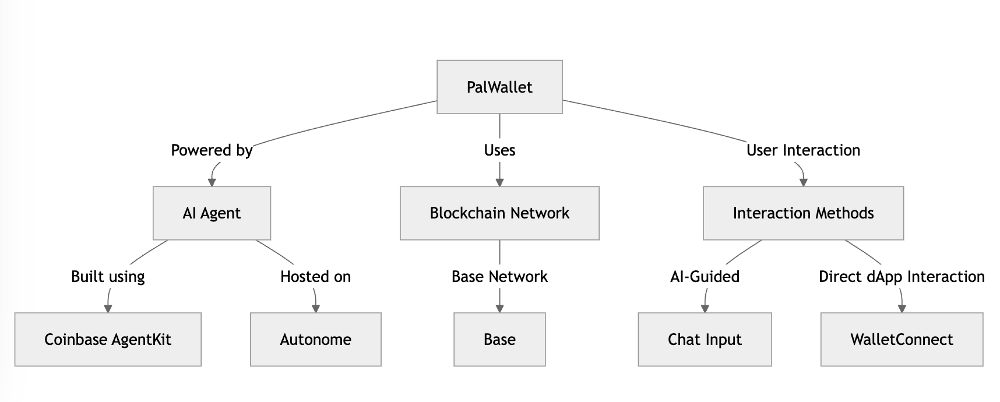

# PalWallet

## Crypto AI Agent Hybrid with Direct Operation

PalWallet is an AI-powered crypto agent that combines intelligent automation with direct user control, offering a seamless experience for both simple and complex blockchain operations.

## Key Benefit

- **AI-Powered Custom Operations** – Execute transactions and manage assets through an AI agent with customizable actions.
- **Flexible Interaction** – Perform tasks via chat-based commands or interact with dApps using WalletConnect.

## Technical Detail

- **Coinbase AgentKit**: AI agent framework used to handle blockchain operations.
  - Added a custom handler for transaction simulation mock and direct transaction execution via WalletConnect. This demonstrates a new architecture solution for AI-powered crypto agents.
- **Autonome**: Decentralized hosting platform for AI agents.
  - Successfully integrated the Autonome backend with a custom frontend, providing an intuitive user interface for seamless chatbot interaction.
- **Base Network**: The primary blockchain network used for transactions.
- **Hybrid Interaction Methods (dApps Fusion)**: Simple operations can be streamlined through **chat-based AI interactions**, but most users require **complex operations** to gain real benefits—such as integrating with new protocols or handling advanced scenarios. **This hybrid interaction system** enables both approaches, **bridging user needs with the capabilities of the crypto AI agent**.
