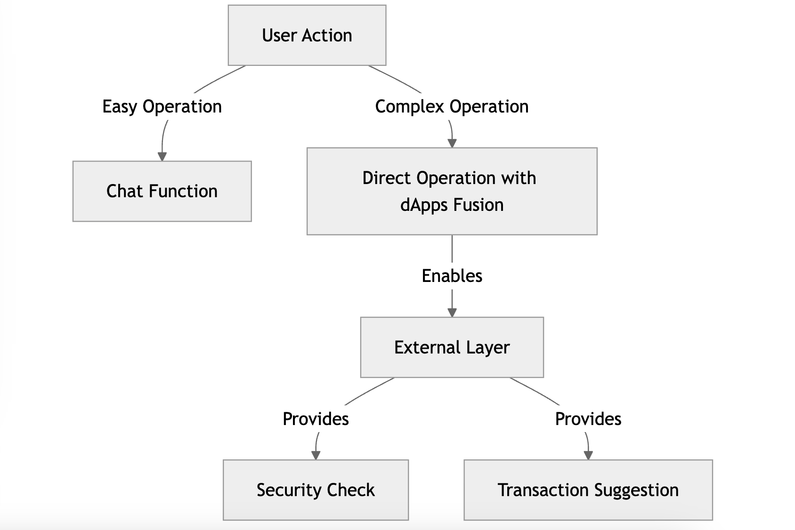
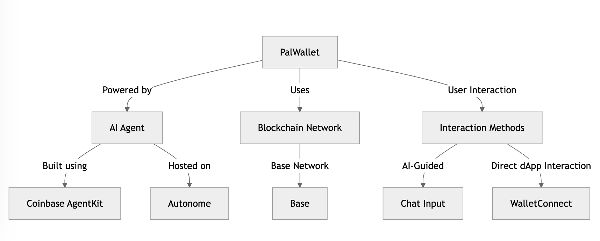
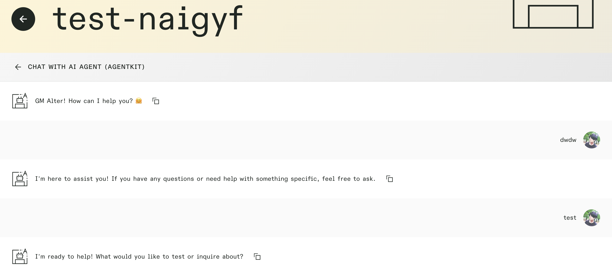

# PalWallet


## Crypto AI Agent Hybrid with Direct Operation

PalWallet is an AI-powered crypto agent that combines intelligent automation with direct user control, offering a seamless experience for both simple and complex blockchain operations.

## Key Benefit

- **AI-Powered Custom Operations** – Execute transactions and manage assets through an AI agent with customizable actions.
- **Flexible Interaction** – Perform tasks via chat-based commands or interact with dApps using WalletConnect.



## Technical Detail



- **Coinbase AgentKit**: AI agent framework used to handle blockchain operations.
  - Added a custom handler for transaction simulation mock and direct transaction execution via WalletConnect. This demonstrates a new architecture solution for AI-powered crypto agents.
- **Autonome**: Decentralized hosting platform for AI agents.
  - Successfully integrated the Autonome backend with a custom frontend, providing an intuitive user interface for seamless chatbot interaction.
  - Connecting custom frontend and Autonome was bit tricky, but though communication via Discord, I was able to figure out to get url and way to bypass the authorization.
- **Base Network**: The primary blockchain network used for transactions.
- **Hybrid Interaction Methods (dApps Fusion)**: Simple operations can be streamlined through **chat-based AI interactions**, but most users require **complex operations** to gain real benefits—such as integrating with new protocols or handling advanced scenarios. **This hybrid interaction system** enables both approaches, **bridging user needs with the capabilities of the crypto AI agent**.

## References

### Live App

[https://2025-agents-palwallet.vercel.app/](https://2025-agents-palwallet.vercel.app/)

### Demo Video

https://youtu.be/cTdHH69y_kk

### Deployed AI Agent

https://autonome.alt.technology/test-naigyf (Password is needed to access, please contact me for that)



### Tx made in Demo

https://sepolia.basescan.org/tx/0x857b41f1a72bbea7db005c90228044fbe6859f9b54409edc875f1eccaabea147

(This is called with AI Agent via Wallet Connect)

### Local Development

For dApps Fusion, it is required to run chatbot locally, please run the following after set the [env](https://github.com/taijusanagi/2025-agents-palwallet/blob/main/chatbot/.env.sample)

```
cd chatbot
npm run build
npm run start
```
