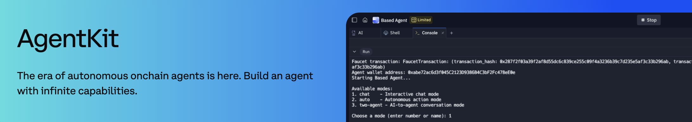
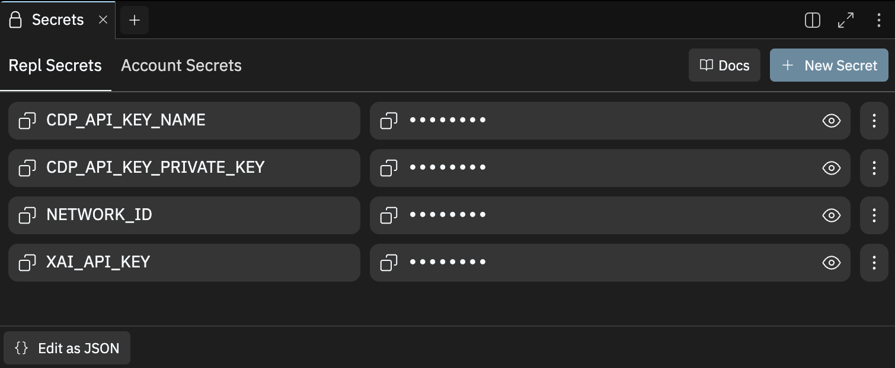

# CDP AgentKit.js SDK

Give your AI Agent its own crypto wallet with the Coinbase Developer Platform (CDP) Agentkit for Node.js! This SDK provides everything you need to bring your AI agents onchain quickly and securely.

## Overview

CDP Agentkit is designed for rapid testing and deployment on Replit, allowing you to create AI agents that can interact with various onchain actions using the CDP SDK.  Simply add your API keys and click "Run" to get started.

## Getting Started

### Prerequisites
- A Replit account
- CDP API keys (obtain from [Coinbase Developer Platform](https://portal.cdp.coinbase.com/signin))
- [xAI API key](https://console.x.ai/) (note that xAI currently offers developers $25 in free API credits)

### Setup Steps

1. **Fork the Template**
   - Click "Fork" to create your own copy of this project

2. **Configure API Keys**
   - Navigate to Tools > Secrets
   - Click "Edit as JSON" **adding the CDP as JSON will naturally fix /n formatting issues that you might otherwise face if copy and pasting directly**
   - Add your CDP API keys and other required secrets
   - 

3. **Launch Your Agent**
   - Click the "Run" button
   - Select your preferred mode:
     - Chat Mode: Interactive conversation with your agent
     - Autonomous Mode: Agent operates independently
  - 

### Deployment

For production deployment, we recommend using Replit Core:
- Ensures reliable uptime
- Provides enhanced performance
- Enables persistent storage

**Note**: Coinbase is currently offering sponsorships to CDP Developers for Replit Core this will give you uppgraded AI and Deployment credits. Contact kevin.leffew@coinbase.com for details.

### Frontend Integration

Once you get the agent going, you can extend it with langchain models.  You may even consider adding a user interface to your agent.  We have a frontend template here that is easy to configure with AgentKit [frontend template](https://replit.com/@alissacrane1/onchain-agent-demo-frontend).

## Key Features

- **Framework Agnostic**: Built with common AI Agent primitives compatible with any AI framework
- **LangChain Integration**: 
  - Built-in support for LangChain.js workflows in this Node.js version
  - For Python developers, check out our [Python version](https://replit.com/@CoinbaseDev/CDP-AgentKit?v=1)
  - More frameworks coming soon!

### What can AgentKit do? 
**AgentKit enables LLMs to take actions onchain, here are some examples**:
  - Request testnet funds via faucet
  - Manage wallet details and balance checks
  - Execute token transfers and trades
  - Register and manage Basenames
  - Deploy and manage ERC20 tokens
  - Create and mint ERC721 NFTs
  - Deploy tokens using Zora's Wow Launcher (Bonding Curve)
  - Trade Zora Wow ERC20 coins
    
## Resources

### Documentation
- [Getting Started Guide](https://docs.cdp.coinbase.com/agentkit/docs/welcome)
- [Core API Reference](https://coinbase.github.io/cdp-agentkit-nodejs/cdp-agentkit-core/index.html)
- [LangChain Extension Reference](https://coinbase.github.io/cdp-agentkit-nodejs/cdp-langchain/index.html)

### Support
- [GitHub Issues](https://github.com/coinbase/cdp-agentkit/issues)
- [Discord Community](https://discord.gg/coinbase-dev)

## Security

We take security seriously. Please review our [Security Policy](SECURITY.md) for:
- Reporting vulnerabilities
- Security best practices
- Responsible disclosure program

## Contributing

We welcome contributions! See our [Contributing Guide](CONTRIBUTING.md) for:
- Development setup
- Coding standards
- Pull request process

## License

This project is licensed under [LICENSE NAME] - see the [LICENSE](LICENSE) file for details.